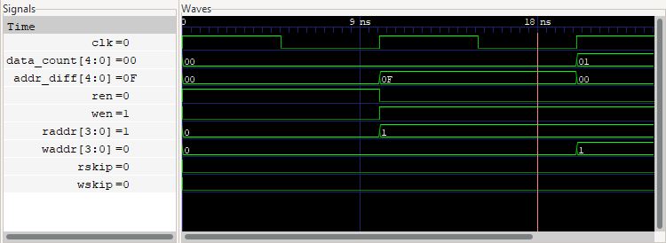
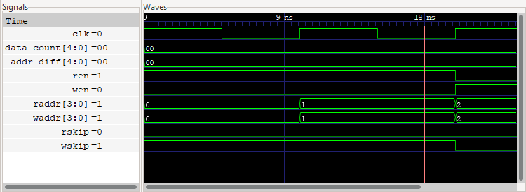

Getting started
===============

.. note:: 

    This tutorial assumes sby and boolector installation as per the 
    :ref:`install-doc`.  For this tutorial, it is also recommended to install 
    `GTKWave <http://gtkwave.sourceforge.net/>`_, an open source VCD viewer.
    `Source files used in this tutorial
    <https://github.com/YosysHQ/sby/tree/master/docs/examples/fifo>`_ can be 
    found on the sby git, under ``docs/examples/fifo``.

First In, First Out (FIFO) buffer
*********************************

From `Wikipedia <https://en.wikipedia.org/wiki/FIFO_(computing_and_electronics)>`_,
a FIFO is 
    
    a method for organizing the manipulation of a data structure (often,
    specifically a data buffer) where the oldest (first) entry, or "head" of the
    queue, is processed first.

    Such processing is analogous to servicing people in a queue area on a
    first-come, first-served (FCFS) basis, i.e. in the same sequence in which
    they arrive at the queue's tail. 

In hardware we can create such a construct by providing two addresses into a
register file.  This tutorial will use an example implementation provided in
`fifo.sv`. 

First, the address generator module:  

.. literalinclude:: ../examples/fifo/fifo.sv
   :language: systemverilog
   :start-at: address generator
   :end-at: endmodule

This module is instantiated twice; once for the write address and once for the
read address.  In both cases, the address will start at and reset to 0, and will
increment by 1 when an enable signal is received.  When the address pointers
increment from the maximum storage value they reset back to 0, providing a
circular queue.

Next, the register file:

.. literalinclude:: ../examples/fifo/fifo.sv
   :language: systemverilog
   :start-at: fifo storage
   :end-before: end storage
   :dedent:

Notice that this register design includes a synchronous write and asynchronous
read.  Each word is 8 bits, and up to 16 words can be stored in the buffer.

Verification properties
***********************

In order to verify our design we must first define properties that it must
satisfy.  For example, there must never be more than there is memory available.
By assigning a signal to count the number of values in the buffer, we can make
the following assertion in the code:

.. literalinclude:: ../examples/fifo/fifo.sv
   :language: systemverilog
   :start-at: a_oflow
   :end-at: ;
   :dedent:

It is also possible to use the prior value of a signal for comparison.  This can
be used, for example, to ensure that the count is only able to increase or
decrease by 1.  A case must be added to handle resetting the count directly to
0, as well as if the count does not change.  This can be seen in the following
code; at least one of these conditions must be true at all times if our design
is to be correct.

.. literalinclude:: ../examples/fifo/fifo.sv
   :language: systemverilog
   :start-at: a_counts
   :end-at: ;
   :dedent:

As our count signal is used independently of the read and write pointers, we
must verify that the count is always correct.  While the write pointer will
always be at the same point or *after* the read pointer, the circular buffer
means that the write *address* could wrap around and appear *less than* the read
address.  So we must first perform some simple arithmetic to find the absolute
difference in addresses, and then compare with the count signal.

.. literalinclude:: ../examples/fifo/fifo.sv
   :language: systemverilog
   :start-at: assign addr_diff
   :end-at: ;
   :dedent:

.. literalinclude:: ../examples/fifo/fifo.sv
   :language: systemverilog
   :start-at: a_count_diff
   :end-at: ;
   :dedent:

SymbiYosys
**********

SymbiYosys (sby) uses a .sby file to define a set of tasks used for
verification.  

**basic**
    Bounded model check of design.

**nofullskip**
    Demonstration of failing model using an unbounded model check.

**cover**
    Cover mode (testing cover statements).

The use of the ``:default`` tag indicates that by default, basic and cover
should be run if no tasks are specified, such as when running the command below.

    sby fifo.sby

.. note:: 

    The default set of tests should all pass.  If this is not the case there may
    be a problem with the installation of sby or one of its solvers. 

To see what happens when a test fails, the below command can be used.  Note the
use of the ``-f`` flag to automatically overwrite existing task output.  While
this may not be necessary on the first run, it is quite useful when making
adjustments to code and rerunning tests to validate.
    
    sby -f fifo.sby nofullskip

The noskip task disables the code shown below.  Because the count signal has
been written such that it cannot exceed MAX_DATA, removing this code will lead
to the ``a_count_diff`` assertion failing.  Without this assertion, there is no
guarantee that data will be read in the same order it was written should an
overflow occur and the oldest data be written.

.. literalinclude:: ../examples/fifo/fifo.sv
   :language: systemverilog
   :start-at: NO_FULL_SKIP
   :end-at: endif
   :lines: 1-5,9

The last few lines of output for the noskip task should be similar to the
following:

.. code-block:: text

    SBY [fifo_nofullskip] engine_0.basecase: ##  Assert failed in fifo: a_count_diff
    SBY [fifo_nofullskip] engine_0.basecase: ##  Assert failed in fifo: ap_underfill
    SBY [fifo_nofullskip] engine_0.basecase: ##  Writing trace to VCD file: engine_0/trace.vcd
    SBY [fifo_nofullskip] engine_0.basecase: ##  Writing trace to Verilog testbench: engine_0/trace_tb.v
    SBY [fifo_nofullskip] engine_0.basecase: ##  Writing trace to constraints file: engine_0/trace.smtc
    SBY [fifo_nofullskip] engine_0.basecase: ##  Status: failed
    SBY [fifo_nofullskip] engine_0.basecase: finished (returncode=1)
    SBY [fifo_nofullskip] engine_0: Status returned by engine for basecase: FAIL
    SBY [fifo_nofullskip] engine_0.induction: terminating process
    SBY [fifo_nofullskip] summary: Elapsed clock time [H:MM:SS (secs)]: 0:00:02 (2)
    SBY [fifo_nofullskip] summary: Elapsed process time unvailable on Windows
    SBY [fifo_nofullskip] summary: engine_0 (smtbmc boolector) returned FAIL for basecase
    SBY [fifo_nofullskip] summary: counterexample trace: fifo_nofullskip/engine_0/trace.vcd
    SBY [fifo_nofullskip] DONE (FAIL, rc=2)
    SBY The following tasks failed: ['noskip']

Using the ``noskip.gtkw`` file provided, use the below command to examine the
error trace.

    gtkwave fifo_nofullskip/engine_0/trace.vcd noskip.gtkw

This should result in something similar to the below image.  We can immediately
see that ``data_count`` and ``addr_diff`` are different.  Looking a bit deeper
we can see that in order to reach this state the read enable signal was high in
the first clock cycle while write enable is low.  This leads to an underfill
where a value is read while the buffer is empty and the read address increments
to a higher value than the write address.

During correct operation, the ``w_underfill`` statement will cover the underflow
case.  Examining ``fifo_cover/logfile.txt`` will reveal which trace file
includes the cover statment we are looking for.  If this file doesn't exist, run
the code below.

    sby fifo.sby cover

Searching the file for ``w_underfill`` will reveal the below.

.. code-block:: text

    $ grep "w_underfill" fifo_cover/logfile.txt -A 1
    SBY [fifo_cover] engine_0: ##  Reached cover statement at w_underfill in step 2.
    SBY [fifo_cover] engine_0: ##  Writing trace to VCD file: engine_0/trace2.vcd

We can then run gtkwave with the trace file indicated to see the correct
operation as in the image below.  When the buffer is empty, a read with no write
will result in the ``wksip`` signal going high, incrementing *both* read and
write addresses and avoiding underflow.
    
    gtkwave fifo_cover/engine_0/trace2.vcd noskip.gtkw

Exercise
********

Adjust the ``[script]`` section of ``fifo.sby`` so that it looks like the below.

.. code-block:: text

    [script]
    nofullskip: read -define NO_FULL_SKIP=1
    read -formal fifo.sv
    hierarchy -check -top fifo -chparam MAX_DATA 17
    prep -top fifo

The ``hierarchy`` command we added changes the ``MAX_DATA`` parameter of the top
module to be 17.  Now run the ``basic`` task and see what happens.  It should
fail and give an error like ``Assert failed in fifo: a_count_diff``. Can you
modify the verilog code so that it works with larger values of ``MAX_DATA``
while still passing all of the tests?

.. note::

    If you need a **hint**, try increasing the width of the address wires.  4 bits
    supports up to :math:`2^4=16` addresses.  Are there other signals that 
    need to be wider?  Can you make the width parameterisable to support 
    arbitrarily large buffers?  

Once the tests are passing with ``MAX_DATA=17``, try something bigger, like 64,
or 100.  Does the ``basic`` task still pass?  What about ``cover``?  By default,
``bmc & cover`` modes will run to a depth of 20 cycles.  If a maximum of one
value can be loaded in each cycle, how many cycles will it take to load 100
values?  Using the :ref:`.sby reference page <Reference for .sby file format>`,
try to increase the cover mode depth to be at least a few cycles larger than the
``MAX_DATA``.

.. note::
    
    Reference files are provided in the ``fifo/golden`` directory, showing how
    the verilog could have been modified and how a ``bigtest`` task could be
    added.

Concurrent assertions
*********************

Until this point, all of the properties described have been *immediate*
assertions.  As the name suggests, immediate assertions are evaluated
immediately whereas concurrent assertions allow for the capture of sequences of
events which occur across time.  The use of concurrent assertions requires a
more advanced series of checks.  Using a parser such as Verific supports these
checks *without* having to write out potentially complicated state machines.
Verific is included for use in the *Tabby CAD Suite*.  

With concurrent assertions we are able to verify more fully that our enables and
status flags work as desired.  For example, we can assert that if the read
enable signal is high then the address of the read pointer *must* change.
Because of our earlier *immediate* assertions that the pointer address can only
increment or remain the same we do not need to specify that here.  We can also
assert that if the enable is low, and the buffer is not full and potentially
requires a skip in the read address, then the read address will *not* change.

.. literalinclude:: ../examples/fifo/fifo.sv
   :language: systemverilog
   :start-at: ap_raddr2
   :end-at: ap_raddr3
   :dedent:
   :lines: 1,5

Further information
*******************
For more information on the uses of assertions and the difference between
immediate and concurrent assertions, refer to appnote 109: `Property Checking
with SystemVerilog Assertions 
<https://yosyshq.readthedocs.io/projects/ap109/en/latest/>`_.
